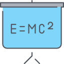

<!DOCTYPE html>
<html lang="en">
  <head>
    <!-- Required meta tags -->
    <meta charset="utf-8" />
    <meta name="viewport" content="width=device-width, initial-scale=1" />

    <!-- Bootstrap CSS -->
    <link
      href="https://cdn.jsdelivr.net/npm/bootstrap@5.0.2/dist/css/bootstrap.min.css"
      rel="stylesheet"
      integrity="sha384-EVSTQN3/azprG1Anm3QDgpJLIm9Nao0Yz1ztcQTwFspd3yD65VohhpuuCOmLASjC"
      crossorigin="anonymous"
    />

    <title>Bootstrap</title>
  </head>
  <body>
    <nav
      class="navbar navbar-expand-lg navbar-light fixed-top"
      style="background-color: rgb(173, 255, 244)"
    >
      

        <a class="navbar-brand" href="#">
          
          PEMALANG
        </a>
        <button
          class="navbar-toggler"
          type="button"
          data-bs-toggle="collapse"
          data-bs-target="#navbarNav"
          aria-controls="navbarNav"
          aria-expanded="false"
          aria-label="Toggle navigation"
        >
          
        </button>
        

          <ul class="navbar-nav ms-auto">
            <li class="nav-item">
              <a class="nav-link" href="home.html">Home</a>
            </li>
            <li class="nav-item">
              <a class="nav-link" href="buku.html">Buku</a>
            </li>
            <li class="nav-item">
              <a class="nav-link" href="kontak.html">Kontak</a>
            </li>
            <li class="nav-item">
              <a class="nav-link" href="login.html">Login</a>
            </li>
          </ul>
        

      

    </nav>
     
     
    

      

        

          
        

        

          
        

        

          
        

      

      <button
        class="carousel-control-prev"
        type="button"
        data-bs-target="#carouselExampleControls"
        data-bs-slide="prev"
      >
        
        Previous
      </button>
      <button
        class="carousel-control-next"
        type="button"
        data-bs-target="#carouselExampleControls"
        data-bs-slide="next"
      >
        
        Next
      </button>
    

     
     

    

      <h2>Perpustakaan Umum Kab.Pemalang</h2>
      

        <h1>Info</h1>
        

          Perpustakaan Umum daerah kabupaten pemalang menyediakan buku dengan
          berbagai macam tema/genre. perpustakaan ini juga menyediakan fasilitas
          yang nyaman untuk para pembaca.
        

      

    

     
     

    <section>
      <h2 style="text-align: center">Pilih Topik Yang Anda Minati</h2>
      

        

          

            
            

              <h5 class="card-title text-center">SEJARAH</h5>
            

          

        

        

          

            
            

              <h5 class="card-title text-center">SAINS</h5>
            

          

        

        

          

            
            

              <h5 class="card-title text-center">KEAGAMAAN</h5>
            

          

        

        

          

            
            

              <h5 class="card-title text-center">TEKNOLOGI</h5>
            

          

        

      

    </section>

    <!-- Optional JavaScript; choose one of the two! -->

    <!-- Option 1: Bootstrap Bundle with Popper -->
    
  </body>
</html>
